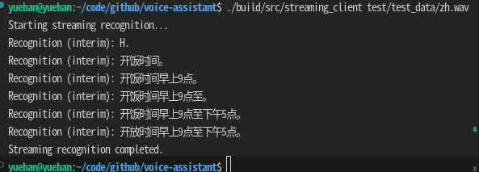

# Voice Assistant

基于 sherpa-onnx 的多语言语音助手，支持中文、英语、日语、韩语和粤语。

## 功能特性

- 支持多语言语音识别：
  - 中文
  - 英语
  - 日语
  - 韩语
  - 粤语
- 基于 gRPC 的服务器-客户端架构
- 使用 sherpa-onnx 作为语音识别引擎
- 支持同步和流式识别模式
- 灵活的命令行配置支持

## 最新改进

### 2024-01-xx
- 优化了 VAD 参数配置
  - 降低阈值到 0.3 提高检测灵敏度
  - 调整最小静音时长为 0.25s
  - 调整最小语音时长为 0.1s
  - 设置最大语音时长为 15s
  - 减小窗口大小到 256 提高实时性

- 改进了流式识别的语音分段
  - 实现了更精确的语音状态检测
  - 优化了中间结果的输出频率
  - 改进了语音段的开始和结束判断
  - 提供更自然的语音分段效果

## 模型下载与准备

### 下载预训练模型

```bash
# 创建模型目录
mkdir -p models

# 下载模型文件（以下二选一）
# 1. 标准模型（更准确，文件更大）
wget https://huggingface.co/csukuangfj/sherpa-onnx-sense-voice-zh-en-ja-ko-yue-2024-07-17/resolve/main/model.onnx -O models/model.onnx

# 2. 量化模型（速度更快，文件更小）
wget https://huggingface.co/csukuangfj/sherpa-onnx-sense-voice-zh-en-ja-ko-yue-2024-07-17/resolve/main/model.int8.onnx -O models/model.int8.onnx

# 下载词表文件
wget https://huggingface.co/csukuangfj/sherpa-onnx-sense-voice-zh-en-ja-ko-yue-2024-07-17/resolve/main/tokens.txt -O models/tokens.txt

# 下载 VAD 模型
wget https://github.com/snakers4/silero-vad/raw/master/src/silero_vad/data/silero_vad.onnx -O models/vad.onnx
```

### 模型说明

1. 模型类型：
   - `model.onnx`：标准浮点模型，准确度更高
   - `model.int8.onnx`：8位量化模型，速度更快，占用空间更小
   - `vad.onnx`：语音活动检测模型

2. 支持语言：
   - 中文 (zh)
   - 英语 (en)
   - 日语 (ja)
   - 韩语 (ko)
   - 粤语 (yue)

3. 模型特点：
   - 自动语言检测
   - 多语言混合识别
   - 标点符号自动添加
   - 数字智能转换
   - 精确的语音活动检测

## 开发进度

### 已完成功能

- [x] 项目基础架构搭建
  - [x] CMake 构建系统
  - [x] 项目目录结构
  - [x] 依赖库集成
- [x] gRPC 服务实现
  - [x] Protobuf 服务定义
  - [x] 服务器端实现
  - [x] 客户端实现
- [x] sherpa-onnx 集成
  - [x] 模型加载
  - [x] 语音识别接口
  - [x] 多语言支持
  - [x] VAD 集成
- [x] 同步语音识别
  - [x] 音频数据处理
  - [x] 识别结果处理
- [x] 流式语音识别
  - [x] 实时音频处理
  - [x] 流式结果返回
  - [x] VAD 语音分段
- [x] 配置系统
  - [x] 命令行参数支持
  - [x] 模型参数配置
  - [x] 服务器参数配置

### 进行中功能

- [ ] 异步语音识别
  - [ ] 任务队列管理
  - [ ] 状态追踪
  - [ ] 结果回调
- [ ] 错误处理优化
  - [ ] 错误码规范
  - [ ] 重试机制
  - [ ] 错误恢复

### 计划功能

- [ ] 配置系统扩展
  - [ ] 配置文件支持
  - [ ] 动态配置更新
  - [ ] 多模型配置
- [ ] 性能优化
  - [ ] 内存池
  - [ ] 线程池
  - [ ] 批处理优化
- [ ] 监控系统
  - [ ] 性能指标收集
  - [ ] 健康检查
  - [ ] 资源使用监控
- [ ] 文档完善
  - [ ] API 文档
  - [ ] 部署文档
  - [ ] 开发指南

## 依赖项

- CMake >= 3.10
- C++17 编译器
- gRPC
- Protobuf
- sherpa-onnx
- sox (用于音频预处理)
- GTest (用于测试)

## 构建

```bash
# 构建 sherpa-onnx
cd dep/sherpa-onnx
mkdir -p build && cd build
cmake -DCMAKE_INSTALL_PREFIX=./install ..
make -j4
make install
cd ../../..

# 构建项目
mkdir -p build && cd build
cmake ..
make
```

## 运行

1. 启动服务器：

基本用法：
```bash
# 使用标准模型
./build/src/voice_server -m models/model.onnx -t models/tokens.txt

# 使用量化模型（速度更快）
./build/src/voice_server -m models/model.int8.onnx -t models/tokens.txt
```

完整参数：
```bash
./build/src/voice_server \
  -m models/model.onnx \          # 或 --model-path：模型文件路径（必需）
  -t models/tokens.txt \          # 或 --tokens-path：词表文件路径（必需）
  -l auto \                       # 或 --language：语言代码（默认：auto，支持：zh/en/ja/ko/yue）
  -n 4 \                         # 或 --num-threads：线程数（默认：4）
  -p cpu \                       # 或 --provider：计算设备（默认：cpu）
  -d \                          # 或 --debug：启用调试模式
  -P 50051                      # 或 --port：服务端口（默认：50051）
```

2. 运行客户端：
```bash
# VAD 测试客户端
./build/src/vad_client input.wav models/vad.onnx

# 流式识别客户端
./build/src/streaming_client input.wav

# 同步识别测试
./build/src/test_client test/test_data/en.wav  # 英语测试
./build/src/test_client test/test_data/zh.wav  # 中文测试
./build/src/test_client test/test_data/ja.wav  # 日语测试
./build/src/test_client test/test_data/ko.wav  # 韩语测试
./build/src/test_client test/test_data/yue.wav # 粤语测试
```

### 流式识别示例输出

使用流式识别客户端处理中文音频文件的输出示例：

<!-- 使用doc/asset/stream.png -->


这个示例展示了：
1. 实时的中间识别结果输出
2. 随着语音输入的增加，识别结果逐步完善
3. 最终输出完整的识别结果

## 配置说明

### VAD 配置
- threshold: 语音检测阈值 (0.3)
- min_silence_duration: 最小静音持续时间 (0.25s)
- min_speech_duration: 最小语音持续时间 (0.1s)
- max_speech_duration: 最大语音持续时间 (15s)
- window_size: 处理窗口大小 (256)

## 许可证

[License信息]
